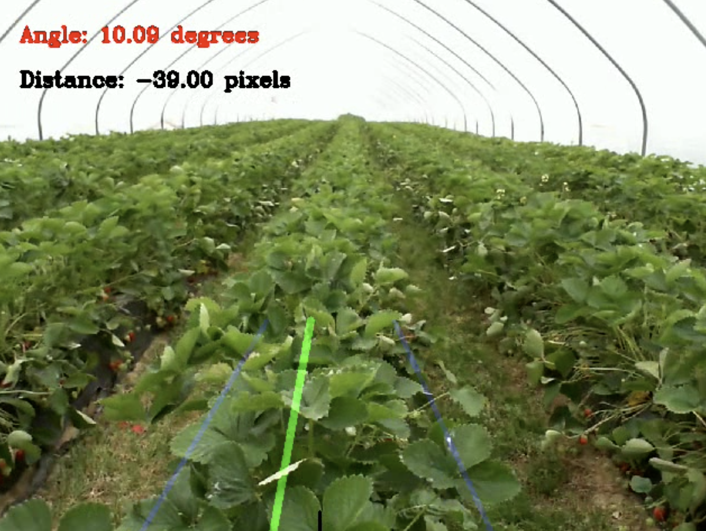

# RoLand - Lane Detection and Orientation Calculation

This is a project that focuses on lane detection and orientation calculation for a robot equipped with a webcam. The project aims to detect the lane on a strawberries field, calculate its position and orientation with respect to the camera, and determine the displacement of the robot across the lane.




## Directory Structure

The repository has the following directory structure:

- #### 254473_import-images_001

Labeled images exported from Supervisely.

- #### dataset

Frames exported from rosbag and then filtered by `detect.py`.

- #### datasets

Datasets created by `create_datasets.py`.

- #### documentation

Detailed explanation of the process of the project.

- #### media

Videos and images generated during the process.

- #### ros

Node that subscribes to the `/video_frames` topic to perform lane detection, and required package.

- #### trials

Different training results. Each `runs` directory has the `best.pt` model in `segment/train/weights` and the hyperparameters used for training in `segment/train/args.yaml`.


## Dataset Creation

The images used for training, validating, and testing were obtained from rosbag files from the robot's webcam. To convert this data into videos, the `ros2bag2video.py` script was modified. After obtaining the videos, a laplacian filter was applied to filter out blurry images. The labeled images were then uploaded to the Supervisely Platform for labeling.

## YOLO (You Only Look Once)

YOLOv8, the latest version of the YOLO algorithm, was used for real-time object detection. The model was trained on the labeled lane images using the `data_config.yaml` file. The best model was selected based on training results and saved for further use.

## Orientation and Position Detection

The middle of the lane is determined by calculating the average of left and right lane boundaries. The rotation angle of the robot with respect to the lane is determined using trigonometry. The threshold region is defined to trigger a warning for lane correction. The displacement of the robot across the lane is calculated based on the reference point chosen.

## Usage

To replicate the results, follow these steps:

1. Clone this repository.
2. Create and activate a virtual environment (optional but recommended):
```
python3 -m venv env
source env/bin/activate
```
3. Install the required packages from the `requirements.txt` file:
```
pip install -r requirements.txt
```
4. Prepare the dataset and labeling as described in the `Dataset Creation` section.
5. Configure the `data_config.yaml` file for YOLO training.
6. Run the YOLO training script with the appropriate parameters.
7. Use the trained model for lane detection and orientation calculation.
8. Test the `lane_detection.py` script to see the final results.

